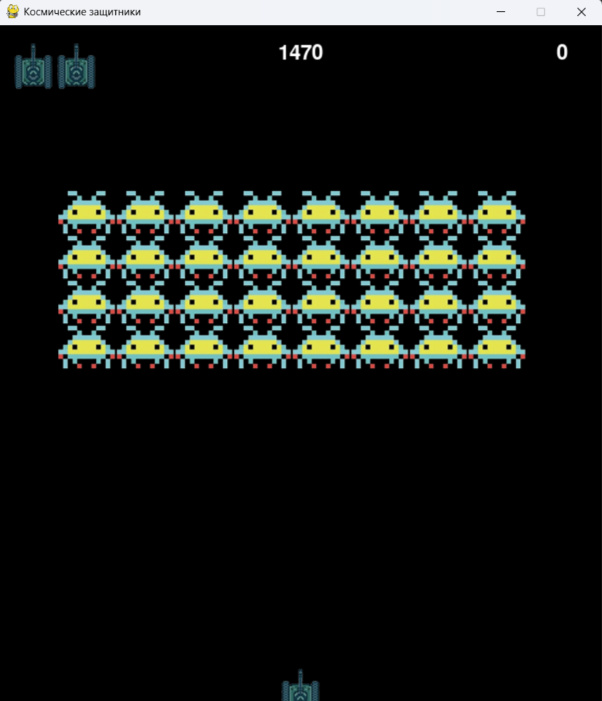

# Alien_invasion
### Alien Invasion — это классический пиксельный шутер, вдохновленный ретро-играми. Игрок управляет танком-защитником в нижней части экрана и должен отбиваться от волн инопланетных захватчиков. 
:medal_military:  Цель - уничтожить всех пришельцев, не дав им добраться до нижнего края экрана или столкнуться с танком. В игре есть счётчик рекордов, ограниченное количество жизней и неограниченное количество уровней
## ⚡ Основные особенности

<table>
<tr>
<td>

### 🎯 Два типа врагов
Пришельцы движутся волнами сверху вниз. Каждый 3-й враг быстрее и опаснее!

</td>
</tr>
<tr>
<td>

### 💥 Динамическая стрельба
На экране может быть не более **3 пуль** одновременно, что добавляет стратегии.

</td>
</tr>
<tr>
<td>

### 🏆 Система рекордов
Ваш лучший результат автоматически сохраняется в файл `hightscore.txt`.

</td>
</tr>
<tr>
<td>

### ❤️ Три жизни
При столкновении с врагом игра не заканчивается сразу — у вас есть **3 попытки**!

</td>
</tr>
<tr>
<td>

### 📊 Счетчик очков
**+10 очков** за каждого уничтоженного пришельца.

</td>
</tr>
<tr>
<td>

### 🔄 Бесконечные уровни
После уничтожения всех врагов появляется новая, более сильная волна!

</td>
</tr>
</table>

___

